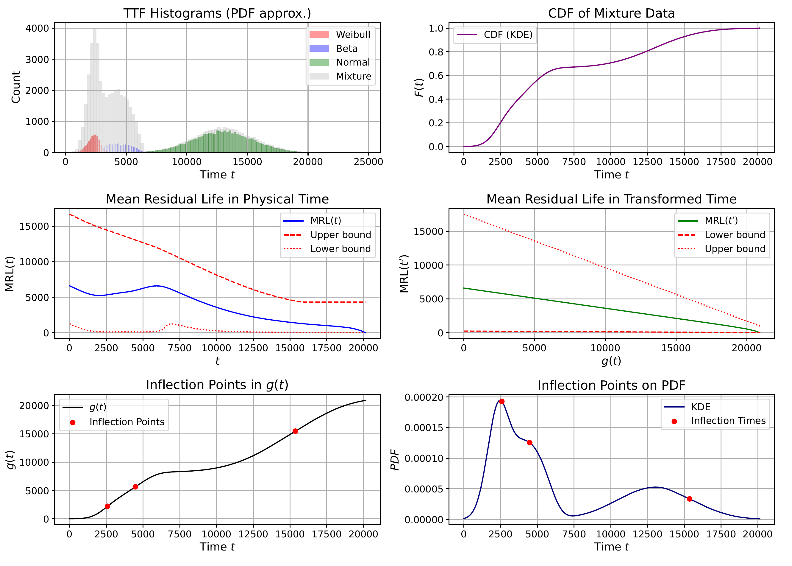

[](https://codecov.io/gh/Roberock/TimeWarperRUL?branch=main)
[](https://github.com/psf/black)

# Time Warper 

_**TimeWarperRUL**_ is a Python library for analyzing Remaining Useful Life (RUL) through time warping transformations. 
It provides parametric estimation of a nonlinear transformation function $t'=g(t)$:

$$g(t)=\frac{\mu}{k} \left(1- R(t)^{\frac{k}{1-k}}  \right).$$

By applying $g(t)$ non-linear possibly non-monotonic, Mean Residual Life MRL(t) functions are transformed in 
linearly decreasing $MRL(t') = \mu  - kg(t)$ in the transformed time $t'$. 

This transformation allows analytical derivation of confidence bounds on the Remaining Useful Life RUL: 

$$RUL(t') \in [s^{-}_\alpha(t'), s^{+}_\alpha(t')]$$  
$$RUL(t') \in [s^{-}_\alpha(t), s^{+}_\alpha(t)]$$

which can be transformed into non-linear RUL bounds in the original time: 

$$RUL(t) \in [L_\alpha(t), U_\alpha(t)]$$
 
 
## 📚 Cite This Work
```bib 
@article{dersin2025rul,
  author    = {Pierre Dersin and Roberto Rocchetta},
  title     = {Analysis of RUL Dynamics and Uncertainty via Time Transformation},
  year      = {2025},
  note      = {Under review},
}
```

## 🔧 Installation

1. Clone the repository:
   ```bash 
   git clone https://github.com/Roberock/TimeWarperRUL.git
   cd TimeWarperRUL  
   ```
2. Install dependencies:
   ```bash
   pip install -r requirements.txt
   ```


## 🚀 Quick Start


See `examples/demos` for a more detailed example.


## 📈 Example Output

Example of nested RUL intervals under a mixture model:

<p align="center">
  
</p>

## 🧠 Features

* 📈 Time Warping Function
* 🔁 Support for parametric and non-parametric models 
* 📍 Detection of inflection points in g(t) and RUL bounds
* 📊 Bootstrap-based uncertainty quantification 
* 🧪 Draft Integration with Lifelines


## 📁 Module Structure 

```bash
   rul_timewarping/
   │
   ├── timewarping.py            # Core class for g(t) and RUL analysis, including non-parametric analysis
   ├── parametrictimewarping.py  # Example class Integration with Lifelines for parametric modelling 
   ├── bootstrap.py              # Bootstrap logic for sampling uncertainties
   ├── plotting.py               # Plotting for visualizing g(t), RUL, inflection points
   └── utils.py                  # Helper and utils functions
```


## 📜 License
MIT 


## 🙋 Contributing
Contributions are welcome!
Please open an issue or pull request for bugs, features, or improvements.